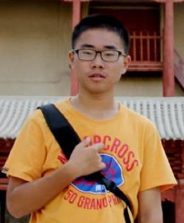

### *Hi, there!*
{: .text-blue}

# Welcome to Wen Fan's homepage
{: .text-purple}

I am a CS undergraduate from University of Science and Technology of China (USTC). I am interested in program analysis and database. I am working with Prof. [Yongle Zhang](https://yonglezh-purdue.github.io/) in Purdue University.

  <a style="text-decoration:none" href="../personal/WenFan_CV.pdf">
     CV 
  </a>
  &nbsp;&nbsp;&nbsp;
  <a style="text-decoration:none" href="https://github.com/fanweneddie">
    <i class="fa fa-github" style="font-size:24px;"></i>
  </a>
   &nbsp;&nbsp;&nbsp;
  <a style="text-decoration:none" href="mailto:eddie@mail.ustc.edu.cn">
    <i class="fa fa-envelope" style="font-size:24px;"></i>
  </a>

