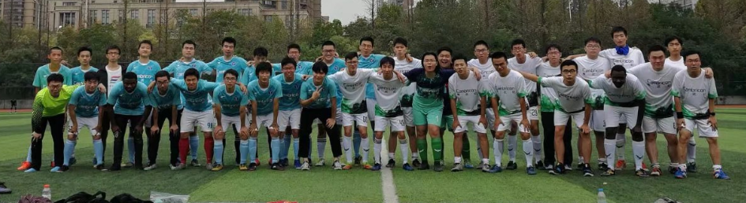
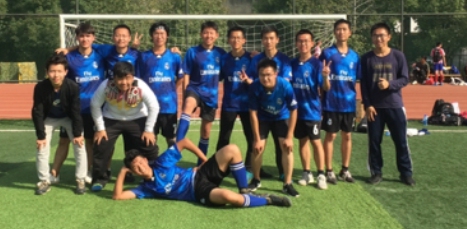
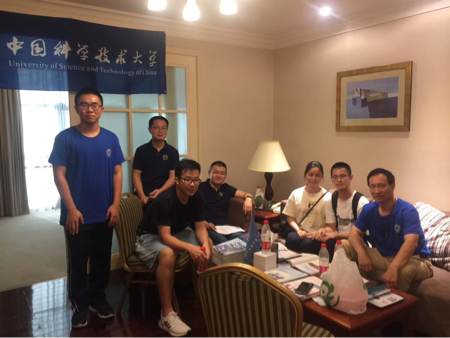
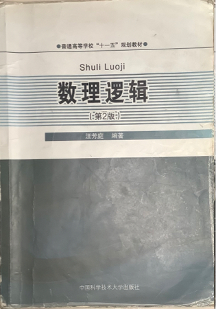
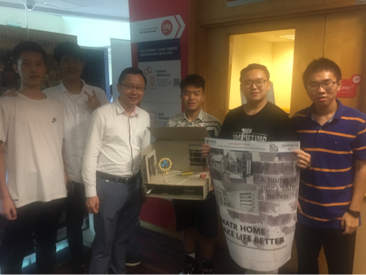

My college life is not only with GPA and lab work. In fact, I had a lot of fun in USTC.

Firstly, I can't live a life without football.

- From Nov 2018 to May 2021, I was a center-back in HuoSu football team. I enjoyed playing with my teammates.

  

 

 

- From Sept to Nov in 2019, I was a coach of CS Freshman football team. We trained hard every week and we were qualified from the group stage.

  

 

 

Also, I like to contribute to my school.

- In July 2020, I was a volunteer in USTC freshman recruitment. We were super busy during those days.

  

 

 

- From March to June 2021, I served as a TA of Mathematical Logic. I really appreciated the diligence of my coworkers and students, and I found that teaching is challenging but interesting.

  

 

Last but not least, I was happy to communicate with students from other schools.

- In July 2019, I took part in NUS Summer Workshop and worked with my friends from UESTC. We finally built a demo of smart home.

  

 

- In Nov 2021, I participated in Pingcap Talent Plan and tried to implement [Raft](https://github.com/fanweneddie/tinykv). I admire the coding ability of students from HUST.